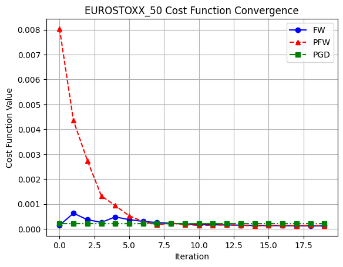
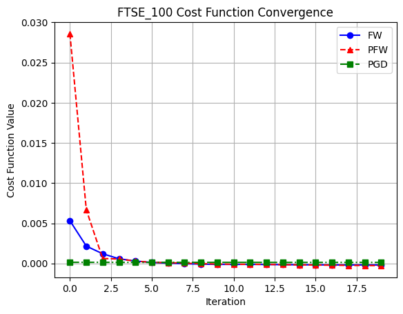

# Portfolio Optimization using Frank-Wolfe and Gradient Descent

## Overview
This project implements **Markowitz Portfolio Optimization** using three optimization algorithms:

- **Frank-Wolfe Algorithm (FW)**
- **Pairwise Frank-Wolfe Algorithm (PFW)**
- **Projected Gradient Descent (PGD)**

The optimization is applied to two financial datasets:
1. **EUROSTOXX 50** (48 assets)
2. **FTSE 100** (79 assets)

The goal is to find an **optimal asset allocation** that minimizes **portfolio risk** (variance) while maintaining a target return.

---

## Methodology
We solve the **mean-variance optimization problem** using:

$$
\text{Cost} = \frac{1}{2} w^T \Sigma w + \lambda (m_\beta - w^T \mu)
$$


Where:
- \( w \) = Portfolio weights
- \( \Sigma \) = Covariance matrix (risk)
- \( \lambda \) = Regularization parameter
- \( \mu \) = Expected returns vector
- \( m_\beta \) = Target return (mean of expected returns)

Three algorithms are compared based on their **cost function convergence and execution speed**.

---

## Results
### Cost Function Convergence

**EUROSTOXX 50**


**FTSE 100**


### Observations
- **Pairwise Frank-Wolfe (PFW)** shows the **fastest convergence** in the initial iterations.
- **Projected Gradient Descent (PGD)** achieves stable convergence with the **lowest cost function values**.
- **Frank-Wolfe (FW)** takes longer to converge but follows a smooth reduction in cost.
- **All methods converge to an optimal solution** with minor variations in execution time.

---

## Installation
Clone this repository and install dependencies:
```bash
git clone https://github.com/YOUR_USERNAME/portfolio-optimization.git
cd portfolio-optimization
pip install numpy pandas matplotlib

